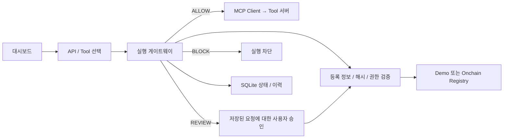

# MCP Sentinel

**AI가 선택한 Tool을 실행하기 전에 등록 정보·무결성·권한을 검증하는 MCP 게이트웨이.**

팀 프로젝트를 시작할 수 있는 실행 가능한 MVP입니다. 실제 MCP Client/Server 통신, `ALLOW / REVIEW / BLOCK`, 사용자 승인, SQLite 이력, Solidity Registry와 로컬 체인 연결을 포함합니다.

> 기본 모드는 **데모 Registry + 키워드 기반 Tool 선택**입니다. LLM을 호출하거나 블록체인에 기록한 것처럼 표시하지 않습니다. 환율은 고정된 샘플 값이며, 보고서는 로컬 파일에 저장합니다. 실제 체인은 별도로 `REGISTRY_MODE=onchain`으로 실행합니다.

## 빠른 시작

필요 환경: **Node.js 24**, **pnpm 11.19.0**. pnpm이 없다면 `npm install -g pnpm@11.19.0`으로 설치하세요.

```sh
git clone https://github.com/skguskim/MCPsentinel.git
cd MCPsentinel
pnpm install
pnpm dev
```

[http://localhost:3000](http://localhost:3000)을 엽니다. API 키·지갑·테스트 ETH 없이 시작할 수 있습니다.

| 서비스            | 주소                               |
| ----------------- | ---------------------------------- |
| Next.js 대시보드  | `http://localhost:3000`            |
| Express API       | `http://127.0.0.1:4000/api/health` |
| MCP Tool 서버     | `http://127.0.0.1:4100/mcp`        |
| 프로젝트 Manifest | `http://127.0.0.1:4100/manifest`   |

`pnpm dev`는 세 프로세스를 함께 실행하고 API와 Tool 서버가 공유하는 임시 인증 토큰을 생성합니다. 터미널에서 Ctrl+C를 누르면 종료됩니다. 코드를 수정한 뒤 이 명령을 재시작하세요. 각 서비스의 `dev:*` 명령으로 따로 실행할 경우 API와 Tools에 같은 `TOOL_AUTH_TOKEN` 환경 변수를 설정해야 합니다.

## 직접 시연하기

1. **정상** 선택 → `달러 환율 알려줘` → `ALLOW` 후 샘플 환율 표시.
2. **정상** 선택 → `이번 주 보고서 업데이트해줘` → `REVIEW` 상태에서 실행 대기 → 인자를 확인하고 승인 → 보고서 저장.
3. **Manifest 변조** 선택 → 환율 요청 → 실제 Tool 서버의 Manifest가 달라져 `BLOCK`.
4. **폐기 / 버전 불일치 / 권한 위반 / Registry 장애** 각각 선택 → 환율 요청 → `BLOCK`.
5. 정상 상태에서 보고서 요청을 만든 뒤 **폐기**로 바꾸고 기존 요청 승인 → 실행 직전 재검증으로 차단.

데모 시나리오는 모든 데모 Tool에 적용되며 실제 Registry 트랜잭션을 발생시키지 않습니다. `onchain` 모드에서는 시나리오 변경 API와 Tool 서버의 시나리오 제어가 비활성화됩니다.

## 실제 로컬 블록체인 연결

첫 번째 터미널에서 체인을 실행한 채 유지합니다.

```sh
pnpm chain
```

두 번째 터미널에서 기본 앱을 실행한 채 유지합니다. 시나리오는 **정상**이어야 합니다.

```sh
pnpm dev
```

세 번째 터미널에서 컨트랙트를 배포하고 두 Tool의 Manifest를 등록·승인합니다.

```sh
pnpm chain:deploy
pnpm chain:seed
pnpm --filter @mcpsentinel/contracts smoke
```

배포 주소와 ABI는 `packages/contracts/deployments/localhost.json`에 생성됩니다. `smoke`는 로컬 체인에서 폐기·재승인을 실제로 수행하고 두 Tool을 정상 승인 상태로 돌려놓습니다.

이제 앱을 Ctrl+C로 종료한 뒤 루트에 `.env`를 만들고 다음 한 줄을 넣습니다.

```dotenv
REGISTRY_MODE=onchain
```

다시 `pnpm dev`로 실행하면 UI에 온체인 모드가 표시되고, 매 검증마다 실제 컨트랙트를 읽습니다. 체인이 꺼졌거나 응답이 잘못되면 실행을 차단하며 데모 Registry로 대체하지 않습니다. 체인을 재시작했으면 다시 배포·시드해야 합니다.

별도 테스트넷은 `RPC_URL`, `CHAIN_ID`, `REGISTRY_ADDRESS`, 게시자와 배포 키를 일치시켜 연결할 수 있습니다. 이번 MVP에서 자동 배포한 범위는 로컬 체인입니다. 자세한 컨트랙트 사용법은 [packages/contracts/README.md](packages/contracts/README.md)를 참고하세요.

## 팀별 작업 위치

| 담당              | 파일/폴더                                                    | 다음 작업                                               |
| ----------------- | ------------------------------------------------------------ | ------------------------------------------------------- |
| 블록체인          | `packages/contracts/`, `apps/api/src/registry.ts`            | 승인자 관리 화면, 테스트넷 배포, 버전 이력              |
| 프론트/백엔드     | `apps/web/`, `apps/api/src/app.ts`, `gateway.ts`, `store.ts` | 사용자 로그인, 사용자별 승인 정책, 운영 배포            |
| MCP ① Client/AI   | `apps/api/src/mcp.ts`, `gateway.ts`의 `plan()`               | 키워드 라우터를 LLM Tool calling으로 교체               |
| MCP ② Server/검증 | `apps/tools/`, `packages/shared/`                            | 실제 외부 API Tool, 서명된 Manifest, 추가 검증 시나리오 |

공통 데이터 형식과 해시 함수는 `@mcpsentinel/shared`에서 가져오세요. 다른 담당자가 각자 JSON 정렬·해시 방식을 다시 구현하면 정상 Tool도 차단될 수 있습니다.

```text
apps/
  web/                  Next.js 대시보드
  api/src/
    app.ts              HTTP 요청·승인·이력 API
    gateway.ts          판정과 실제 실행 통제, 데모 Tool 선택
    mcp.ts              MCP Client / Manifest 조회
    registry.ts         Demo / Onchain Registry 어댑터
    store.ts            SQLite 실행 상태·이벤트 저장
  tools/src/            인증된 MCP 서버와 시연용 Tool
packages/
  shared/src/index.ts   공통 스키마·해시·검증 규칙
  shared/src/demo.ts    신뢰할 초기 데모 Manifest와 입력 형식
  contracts/            Solidity·Hardhat·배포·시드·테스트
```

## 실행과 신뢰 경계



- 등록·승인·폐기는 온체인 변경이며, 실행 전 검증은 `readContract` 조회입니다. 실행마다 트랜잭션을 보내지 않습니다.
- 데모 Registry의 신뢰 기준은 저장소에 포함된 초기 Manifest입니다. 실행 시 받아온 Manifest를 자동으로 신뢰·승인하지 않습니다.
- Publisher, 승인 여부, 버전, Manifest·Permission 해시, 폐기 상태, `tools/list`의 이름·설명·입력 형식, 정책상 권한을 비교합니다.
- `report:write`는 사용자가 승인할 수 있고, 허용·승인 대상이 아닌 권한은 차단합니다. LLM이나 요청 본문에서 권한을 부여할 수 없습니다.
- `REVIEW`는 실행하지 않습니다. 승인은 저장된 인자·Manifest 해시에 묶이며 10분 후 만료됩니다. 승인 시 Registry와 Manifest를 다시 확인합니다.
- 승인은 한 프로세스 안에서 직렬 처리합니다. 실제 호출 전에 재실행할 수 없는 상태를 저장하므로, 중복 승인·프로세스 종료 후 승인 재시도로 같은 실행이 반복되지 않습니다. 네트워크 오류 후 Tool의 실행 여부가 불확실한 경우 자동 재시도하지 않습니다.
- Tool 서버는 게이트웨이 토큰 없이 호출할 수 없습니다. 임의의 사용자·LLM 제공 URL로 연결하지 않으며 모든 서비스는 loopback에 바인딩됩니다.

**보장 범위:** 등록된 Metadata와 실행 정책을 확인하고 이 게이트웨이를 통한 호출을 통제합니다. Manifest 해시는 원격 코드의 안전성을 증명하지 않으며, 원격 서버 내부의 파일·네트워크 행동을 샌드박싱하지 않습니다. 운영용으로 배포하려면 사용자 인증·권한 격리, TLS, 서명된 배포물/서버 신원 검증, 실행 환경의 권한 제한, 다중 인스턴스 승인 잠금 등이 추가로 필요합니다. 현재 앱의 승인 UI는 로컬 단일 사용자 데모입니다.

## API

| 요청                         | 의미                                           |
| ---------------------------- | ---------------------------------------------- |
| `GET /api/health`            | Registry 모드, 라우팅 방식, 현재 데모 시나리오 |
| `GET /api/tools`             | Tool 목록과 등록 상태                          |
| `POST /api/runs`             | 요청 생성과 검증, 허용 시 실행                 |
| `GET /api/runs`              | 최근 실행 100개                                |
| `GET /api/runs/:id`          | 특정 실행 상태                                 |
| `POST /api/runs/:id/approve` | 저장된 승인 대기 요청 재검증·실행. 본문 `{}`   |
| `POST /api/runs/:id/reject`  | 승인 대기 요청 거절. 본문 `{}`                 |
| `POST /api/demo/scenario`    | 데모 모드 시나리오 변경                        |

`POST /api/runs` 예시:

```json
{ "prompt": "달러 환율 알려줘" }
```

LLM 담당자는 아래처럼 Tool과 인자를 확정해서 전달할 수 있습니다. 최종 판정·실행은 계속 게이트웨이를 통과해야 합니다.

```json
{
  "toolId": "exchange_rate",
  "arguments": { "base": "USD", "quote": "KRW" }
}
```

## 검증

```sh
pnpm typecheck
pnpm test
pnpm test:contracts
pnpm build
pnpm format:check
```

- 공유 모듈: JSON 정규화·해시 일치, 승인·폐기·위장·변조·권한 정책.
- API: 실제 MCP HTTP 호출, 승인 전 미실행, 동시 승인 1회 실행, 거절, 승인 중 상태 변경, 잘못된 인자, 차단 시 서버 실행 횟수 불변, 브라우저 Origin·서버 인증, SQLite 재개방.
- 컨트랙트: 등록·ID 소유권·승인자 권한·버전 변경·폐기·명시적 재승인.
- 로컬 체인 smoke: 실제 Registry 어댑터 조회와 폐기·재승인 반영.

## 설정과 데이터

루트 `.env.example`을 참고하세요. `pnpm dev`는 루트 `.env`를 읽습니다. 배포·시드 명령은 셸에 설정된 환경 변수를 읽으며 `.env`를 자동으로 읽지 않습니다.

실행 정보는 `data/sentinel.sqlite`, Tool 실행 확인용 기록은 `data/tools/executions.jsonl`, 보고서는 `data/tools/reports.jsonl`에 저장됩니다. 이 데이터와 `.env`, 배포 산출물은 Git에 포함되지 않습니다. `DATA_DIR`로 별도의 데이터 위치를 지정할 수 있습니다.

사용자 지정 포트는 `API_PORT`, `TOOLS_PORT`, `WEB_PORT`를 설정하세요. `TOOL_SERVER_URL`은 API가 연결할 MCP 서버의 기본 URL입니다. 기본 시작 스크립트가 웹 프록시 주소와 서버 간 토큰을 맞춰 줍니다.

## 공식 문서

- [MCP TypeScript SDK v2](https://github.com/modelcontextprotocol/typescript-sdk)
- [Hardhat](https://hardhat.org/docs/getting-started)
- [OpenZeppelin AccessControl](https://docs.openzeppelin.com/contracts/5.x/access-control)
- [viem readContract](https://viem.sh/docs/contract/readContract)
- [Next.js](https://nextjs.org/docs)
